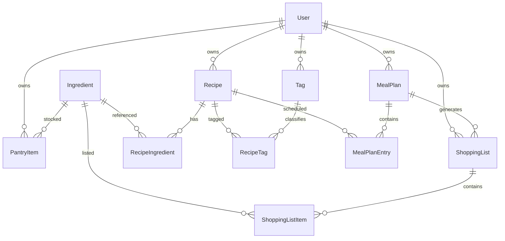

# Data Model

## Naming Note
The initial spec referred to a `VolumeType` enum. It has been renamed to `Unit` because the values cover both volume (ml, cup) and weight (g, lb). Semantics are unchanged — it's still the nullable unit descriptor referenced by `QuantityType`.

## Enums

### QuantityType
Determines **how** an ingredient or pantry item is measured.

```csharp
public enum QuantityType
{
    Volume  = 1,   // ml, L, tsp, tbsp, fl oz, cup, pt, qt, gal
    Weight  = 2,   // g, kg, oz, lb
    Count   = 3,   // discrete whole units ("3 apples")
    InStock = 4    // boolean: have it or don't
}
```

### Unit
Nullable. Required when `QuantityType` is `Volume` or `Weight`. Null for `Count` and `InStock`.

```csharp
public enum Unit
{
    // Volume — Metric
    Milliliter = 10,
    Liter      = 11,

    // Volume — Imperial / US
    Teaspoon   = 20,
    Tablespoon = 21,
    FluidOunce = 22,
    Cup        = 23,
    Pint       = 24,
    Quart      = 25,
    Gallon     = 26,

    // Weight — Metric
    Gram     = 30,
    Kilogram = 31,

    // Weight — Imperial / US
    Ounce = 40,
    Pound = 41
}
```

### MealType
```csharp
public enum MealType { Breakfast = 1, Lunch = 2, Dinner = 3, Snack = 4 }
```

## Tenancy Rules
- **Tenant-scoped** entities carry `UserId` and are restricted by the EF Core global query filter: `Recipes`, `PantryItems`, `MealPlans`, `MealPlanEntries` (via parent), `ShoppingLists`, `ShoppingListItems` (via parent), `Tags`, `RecipeTags` (via parent).
- **Global (shared) reference data**: `Ingredients`. Any authenticated user can read the full catalog, create new entries, and (for MVP) edit existing ones. Delete is blocked when an ingredient is referenced from any recipe/pantry/shopping row (FK restrict). Ingredient uniqueness is enforced by `(Name)` globally.

Ingredients are deliberately global so the catalog grows collaboratively — a user adds "sriracha" once, everyone can reference it. Per-user measurement preferences live on `PantryItem.Unit` and `RecipeIngredient.Unit`, not on the `Ingredient` row.

## Tables

### AspNetUsers
Managed by ASP.NET Core Identity. Standard schema — `Id` (string, 450), `Email`, `NormalizedEmail`, `PasswordHash`, etc.

### Ingredients *(global — not tenant-scoped)*

| Column | Type | Notes |
|--------|------|-------|
| Id | uniqueidentifier (PK) | |
| Name | nvarchar(200) | Globally unique |
| DefaultQuantityType | int | `QuantityType` enum |
| DefaultUnit | int? | `Unit` enum, nullable |
| Category | nvarchar(50)? | e.g., "produce", "dairy" — used for shopping-list grouping |
| CreatedAt | datetime2 | |
| CreatedByUserId | nvarchar(450)? | Audit only; does not scope reads/writes |

**Indexes:** `(Name)` unique · `(Category)`

### Recipes

| Column | Type | Notes |
|--------|------|-------|
| Id | uniqueidentifier (PK) | |
| UserId | nvarchar(450) (FK) | Tenant scope |
| Title | nvarchar(200) | |
| Description | nvarchar(1000)? | |
| Servings | int | Default 1 |
| PrepMinutes | int? | |
| CookMinutes | int? | |
| Instructions | nvarchar(max) | Markdown |
| SourceUrl | nvarchar(500)? | |
| CreatedAt | datetime2 | |
| UpdatedAt | datetime2 | |

**Indexes:** `(UserId, Title)`

### RecipeIngredients

| Column | Type | Notes |
|--------|------|-------|
| Id | uniqueidentifier (PK) | |
| RecipeId | uniqueidentifier (FK → Recipes, cascade delete) | |
| IngredientId | uniqueidentifier (FK → Ingredients, restrict) | |
| Quantity | decimal(10,3) | |
| QuantityType | int | `QuantityType` |
| Unit | int? | `Unit`, nullable for Count/InStock |
| Notes | nvarchar(200)? | e.g., "finely chopped" |

**Indexes:** `(RecipeId)` · `(IngredientId)`

### PantryItems

| Column | Type | Notes |
|--------|------|-------|
| Id | uniqueidentifier (PK) | |
| UserId | nvarchar(450) (FK) | Tenant scope |
| IngredientId | uniqueidentifier (FK, restrict) | |
| Quantity | decimal(10,3) | 0 or 1 for InStock items |
| QuantityType | int | `QuantityType` |
| Unit | int? | `Unit`, nullable |
| LowStockThreshold | decimal(10,3)? | Null = no threshold |
| UpdatedAt | datetime2 | |

**Indexes:** `(UserId, IngredientId)` unique · `(UserId)`

### Tags

| Column | Type | Notes |
|--------|------|-------|
| Id | uniqueidentifier (PK) | |
| UserId | nvarchar(450) | Tenant |
| Name | nvarchar(50) | |

**Indexes:** `(UserId, Name)` unique

### RecipeTags (join)

| Column | Type |
|--------|------|
| RecipeId | uniqueidentifier (FK, cascade) |
| TagId | uniqueidentifier (FK) |

**PK:** composite `(RecipeId, TagId)`

### MealPlans

| Column | Type | Notes |
|--------|------|-------|
| Id | uniqueidentifier (PK) | |
| UserId | nvarchar(450) | Tenant |
| WeekStartDate | date | Monday of the week |
| Name | nvarchar(100)? | Optional label |
| CreatedAt | datetime2 | |

**Indexes:** `(UserId, WeekStartDate)` unique

### MealPlanEntries

| Column | Type | Notes |
|--------|------|-------|
| Id | uniqueidentifier (PK) | |
| MealPlanId | uniqueidentifier (FK, cascade) | |
| RecipeId | uniqueidentifier (FK, restrict) | |
| Date | date | |
| MealType | int | `MealType` |
| Servings | int | Defaults to Recipe.Servings |

**Indexes:** `(MealPlanId, Date, MealType)`

### ShoppingLists

| Column | Type | Notes |
|--------|------|-------|
| Id | uniqueidentifier (PK) | |
| UserId | nvarchar(450) | Tenant |
| MealPlanId | uniqueidentifier (FK)? | Null if manually created |
| Name | nvarchar(100) | |
| GeneratedAt | datetime2 | |

### ShoppingListItems

| Column | Type | Notes |
|--------|------|-------|
| Id | uniqueidentifier (PK) | |
| ShoppingListId | uniqueidentifier (FK, cascade) | |
| IngredientId | uniqueidentifier (FK, restrict) | |
| Quantity | decimal(10,3) | |
| QuantityType | int | |
| Unit | int? | |
| IsChecked | bit | Default 0 |
| Source | nvarchar(20) | `"meal-plan"` or `"manual"` |

## ERD



## Tenant Isolation Recap
All tenant-scoped tables carry `UserId`. An EF Core `SaveChangesInterceptor` sets it on insert; a global query filter restricts reads to the current user's claim. `Ingredients` is intentionally excluded from both mechanisms — it's shared reference data.
